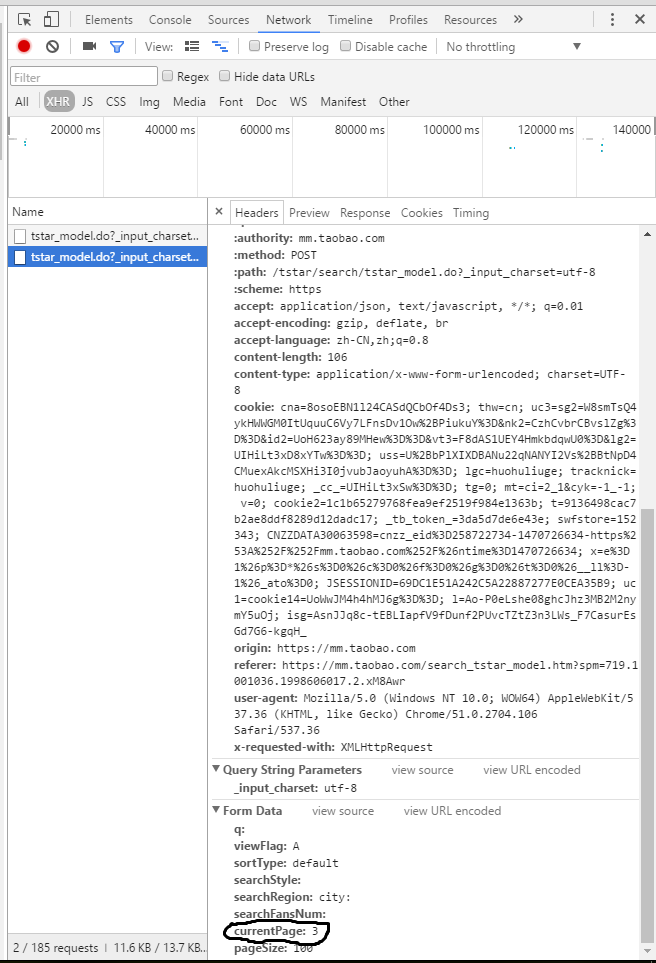

# TaoBaoLady Spider
淘女郎爬虫，可动态抓取淘女郎的信息和照片。  
## 需要额外安装的第三方库  
* requests  
`pip install requests`  
* pymongo  
`pip install pymongo`  

## 模块功能  
* `TaoLady.py`：  负责发送POST请求和抓取个人信息和图片地址并保存到MongoDB中。  
* `Download_Pic.py`： 负责从MongoDB中抽取出淘女郎照片的网址，并下载。   

## 原理  
淘女郎的网站使用了AJAX技术。通过在后台与服务器进行少量数据交换，AJAX 可以使网页实现异步更新。这意味着可以在不重新加载整个网页的情况下，对网页的某部分进行更新。这意味着通过直接抓取网页源代码然后分析出信息的方式是行不通的，因为网站是动态加载的，直接抓取的方式只能抓到网页原始的源代码，并不能抓到动态加载出的淘女郎的信息。  
对于这一类网站，一般有两种抓取办法：第一种是利用`selenium`库来模拟浏览器的用户行为，让服务器以为是真正的用户在浏览网页，从而获得完整的网页源代码；第二种方法是利用`Chrome`等浏览器自带的分析工具，对网页的`Network`进行监控，分析出数据交换的API，从而利用API抓取到数据交换的JSON数据，从而进行抓取。一般来讲，第一种方法速度较慢，并且运行时占用较多的系统资源，所以，条件允许的情况下，尽量使用第二种方法。  
在`Chrome`浏览器中打开淘女郎的主页`https://mm.taobao.com/search_tstar_model.htm?` 按`F12`切换到开发者模式，在`Network`一栏选择`XHR`可以看到目前没有网络活动，但是，在网页中按下下一页的时候，会出现一个名为`https://mm.taobao.com/tstar/search/tstar_model.do?_input_charset=utf-8` 的POST活动，当再次按下下一页的时候，会再次出现一次该活动，所以，可以断定，数据交换使用的就是这个API。然后我们再来对比这两次请求，在`Headers`框的`FromData`栏中，可以看到两次请求的差别在`currentPage`的不同，一个是2，一个是3，这说明，要想得到第几页的数据，这个`currentPage`的值就是多少。所以我们就根据这个，来编写请求，从而得到全部淘女郎信息的JSON文件。  
*******  
## 运行截图  

