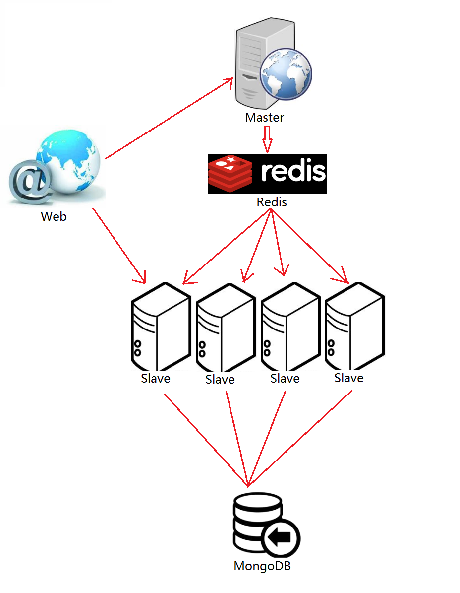

# ZhiHu Spider based on Python
一个分布式的网络爬虫，用于抓取知乎的用户详细信息，包括用户名、行业、位置、毕业院校、介绍、关注者、关注人等。  
## 原理
* 主机    
负责分发任务。从起始位置开始，将当前用户的所有关注者提取出来，并压入`Redis任务队列`，然后随机的进入到其中一个关注者的主页，`递归`上述操作。  

* 从机  
负责抓取网页。连接至`Redis队列`，从中取出一个用户的`URL`，然后对`URL`的内容进行抓取，并保存到`MongoDB`中，然后`循环`上述操作。    
   
## 各模块功能  
* `Master.py`：主机的入口，包含了主机的抓取和去重策略。  
* `Slave.py`：从机的入口。  
* `dbAPI.py`：储存模块，用于将数据存入数据库。  
* `login.py`：登录模块，用于登录到知乎。   
* `utils.py`：工具模块。   
* `Error.py`：异常类模块。   
* `setting.json`：配置文件，用于设置数据库的Host和Port等。  

## 需要额外安装的库
* redis，用于连接Redis  
`pip3 install redis`  
* pymongo，用于连接MongoDB  
`pip3 install pymongo`  
* requests，用于向网站发送请求    
`pip3 install requests`  
* BeautifulSoup，用于解析HTML  
`pip3 install bs4`  
* lxml，配合BeautifulSoup使用，加快解析速度。  
`pip3 install lxml`  
* PyInstaller（非必要，如果有需要的话）  
`pip3 install PyInstaller`  
该库用于将`.py`文件打包为`.exe`文件，这样就可以将从机运行在没有装`Python`的PC机下了。  
如果想要将从机打包，可以将文件夹定位在本目录，然后运行  
`pyinstaller -F Slave.py`


## 需要额外安装的应用  
* `Redis` ：用于构造任务队列。 

* `MongoDB` ：用于存放抓取到的数据。    
**如果使用的是云数据库，可以不用在本地安装Redis和MongoDB。**    
* `Robomongo（非必须，但推荐安装）`：用于可视化管理MongoDB，便于查看数据。  
  

## 需要配置的设置  
需要在setting.json中配置好从机昵称，和数据库设置，如果使用的是本地服务，则无需配置。
```
{
    "user": "liu",
    "proxy_on": true,
    "proxies": [
        "one",
        "two",
        "three",
        "...",
    ],
    "thread_num": 3,
    "sleep": 1,
    "redis": {
        "host": "localhost",
        "port": 6379
    },
    "mongodb": {
        "host": "localhost",
        "port": 27017
    }

}
```
## 运行方法  
* 数据库端  
打开Redis和MongoDB。  
* 主机   
需要准备一个知乎帐号。然后运行  
`python3 Master.py`  
  
* 从机  
在`setting.py`中设置一下从机的昵称（便于区分多个从机），然后运行  
`python3 Slave.py`

## 一种推荐的部署方法  
经过测试，一台主机大概可以保证30个左右的从机的URL供应，所以我们只需要一台计算机作为主机就够用了。在这里我推荐将主机和数据库分开部署，用一台单独的计算机作为Redis和MongoDB服务器（推荐使用阿里云、腾讯云等远程服务器），然后使用自己的计算机作为主机，其他的计算机作为从机。
## 原理图



